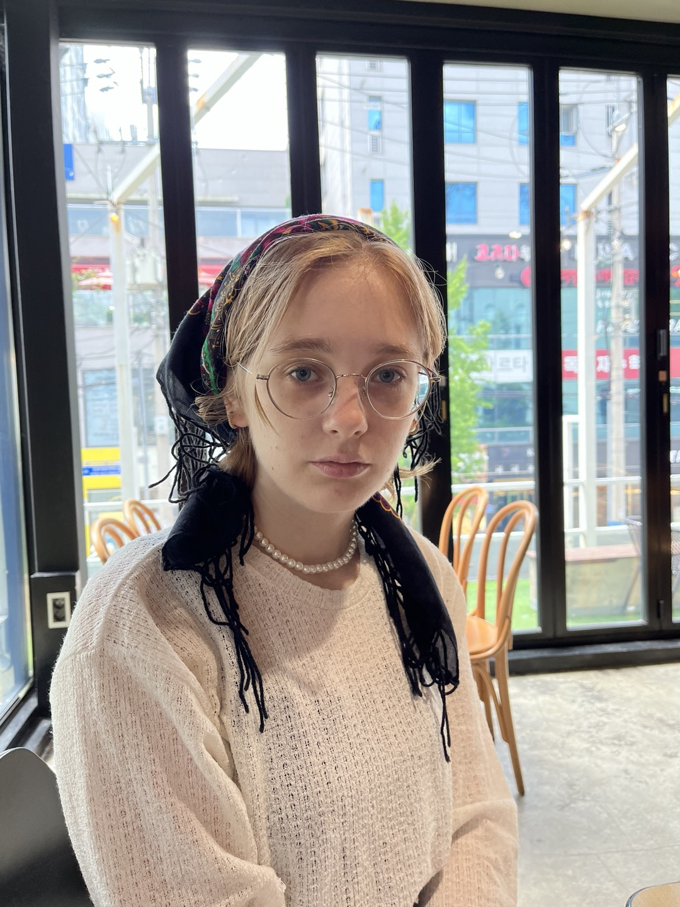

Zosia Marciniak
===

_last updated: March 27th, 2024_

Zosia Marciniak, Master Student -- Expected Graduation Date: August, 2025

Industrial Design, Korea Advanced Institute of Science and Technology (KAIST)

*   Email: zofia.marciniak (at) kaist.ac.kr
*   Linkedin: 
*   Github: 

## Education

*   19'-23' Double Major in Industrial Design and Computer Science, Bachelor Degree, KAIST
*   23'-ongoing Industrial Design, Master Degree, KAIST

## Research Interests

Digital Fabrication, Human-Computer Interaction

## Publications

### International Publications

#### 2024
- CHI

#### 2022
- VRST Poster

### Domestic Publications

#### 2023
- HCIK
- 
#### 2021
- Marciniak, Zofia, Sumin Han, and Dongman Lee. "Understanding the impact of the Weather on Human Mobility via LTE Access Traces in Seoul Districts." *한국 HCI 학회 학술대회*
 (2021): 615-618. [link](https://www.dbpia.co.kr/journal/articleDetail?nodeId=NODE10530300)

## Experiences
- NoMagic: [https://nomagic.ai/) (June, 2022 - Sept, 2022 · 4 mos)
    - Software Engineer Intern
- Google (July, 2021 - Sept, 2021 · 3 mos)
    - STEP intern
